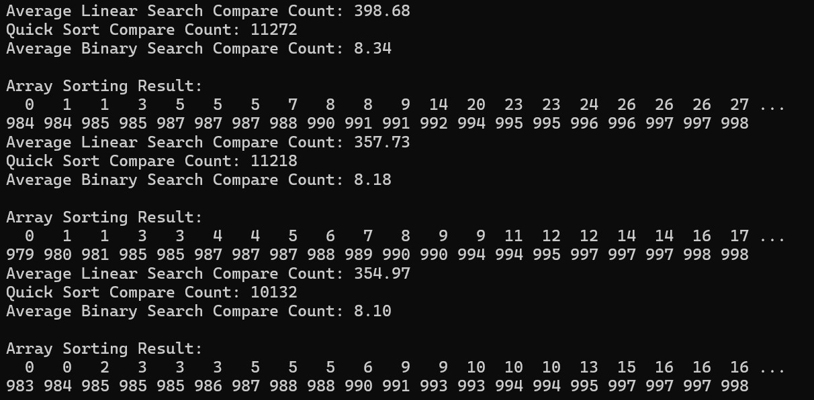

# 15-compareSearches {Result Image}

A인 순차탐색은 배열을 처음부터 끝까지 순차적으로 탐색하는 방식이다.
따라서 배열의 크기만큼 비교 횟수가 증가하기 때문에, 배열 크기가 커질수록 비교 횟수는 선형적으로 증가한다. 
B인 퀵 정렬은 평균적으로 n log n의 시간 복잡도를 가진다. 
따라서 배열의 크기가 커질수록 비교횟수는 n log n에 비례하여 증가한다.
C인 이진 탐색은 정렬된 배열에서만 효율적으로 동작하는 탐색 방법이다.
배열을 절반씩 나누며 검사를 하기 때문에 비교 횟수는 log n에 비례한다.
따라서 퀵 정렬 후 이진 탐색이 순차탐색보다 적게 비교하는 이유는 이진 탐색이 정렬된 배열에서 동작하기 때문이다.
이진 탐색은 시간 복잡도가 log n으로 매우 효율적이므로 퀵 정렬 후 이진 탐색을 수행하는 것이 순차 탐색보다 훨씬 적은 비교 횟수를 가진다.
